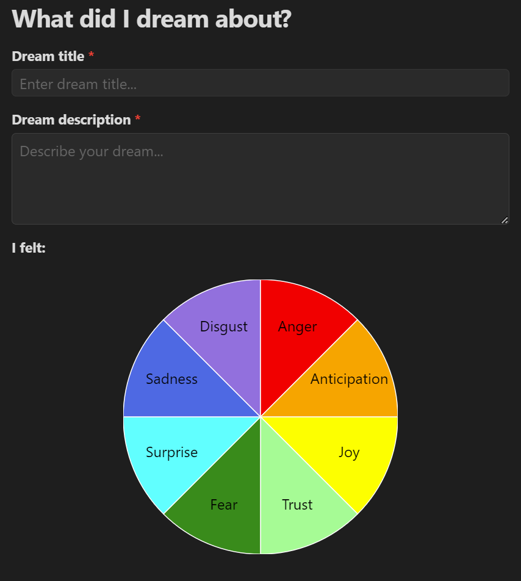
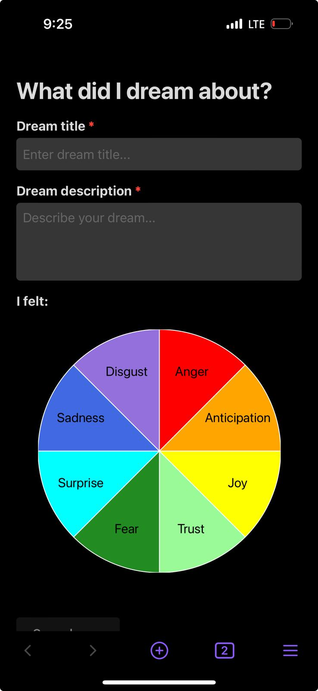

# Dream Journal Plugin



The Dream Journal plugin allows you to record and analyze your dreams directly within Obsidian. Capture dream details, associate emotions, and keep track of your dream experiences over time.

Mobile support:



## Features

- Record dream entries with titles and descriptions
- Select emotions associated with each dream using an emotion wheel
- Automatically save dream entries as Markdown files in your vault
- View and manage your dream journal entries within Obsidian

## Installation

1. Open Obsidian and go to Settings
2. Navigate to Community Plugins and disable Restricted Mode
3. Click on Browse and search for "Dream Journal"
4. Install the plugin and enable it

## Usage

1. Click on the moon icon in the left sidebar or use the command "Record dreams" to open the Dream Journal
2. Enter your dream title and description
3. Use the emotion wheel to select emotions associated with your dream
4. Click "Save dream" to record your entry

## Upcoming features
- Indicate whether or not there was any dream recall for a night.
- Add options to collect lucidity data
- Support exporting dreams bucketed by date range.

## Speculative features
- Dream sign collection
- LuCiD question collection, subsequent analysis. [Initial study](https://www.blogs.uni-mainz.de/fb05philosophie/files/2013/04/Voss-et-al-2013_Measuring-Consciousness-in-Dreams.pdf) by Voss et al 2013
- Dream lucidity questionnaire by [Stumbrys et al 2013](https://boris.unibe.ch/40302/1/11137-17819-2-PB.pdf)

## Development

This plugin is built using TypeScript and React. To set up the development environment:

1. Clone this repository
2. Run `npm install` to install dependencies
3. Run `npm run dev` to start the development build process

## Building

To create a production build, run:

```
npm run build
```

## Attribution

This plugin uses [React](https://reactjs.org/), a library for building user interfaces.

## License

[MIT License](LICENSE)
